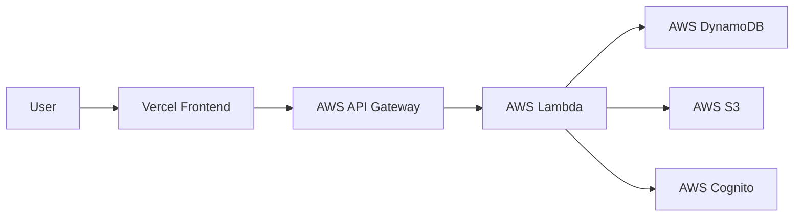
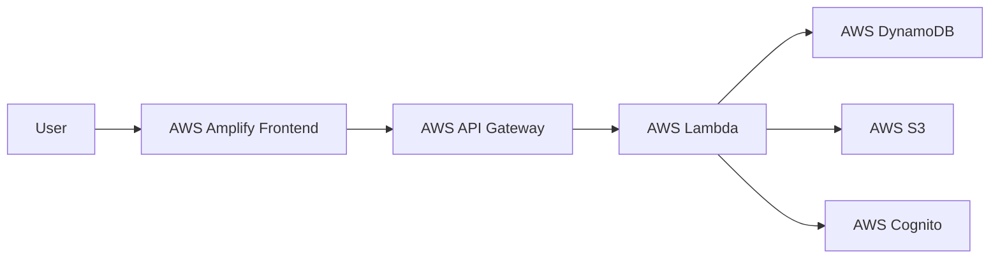

# StoreIt - Cloud File Storage Platform 🚀

A modern, scalable cloud file storage application built with **AWS serverless architecture**, featuring secure file management, real-time sharing, and intelligent storage optimization.

## 🌟 Live Demo
- Vercel 👉  https://storeit-v2.vercel.app/
- AWS Amplify 👉  https://main.d35pzumyrq6z5v.amplifyapp.com/

## 🏗️ Architecture

### System Flow Diagram

#### Option 1: Vercel Deployment


#### Option 2: AWS Amplify Deployment


## 🚀 Key Features

- **📁 File Management**: Upload, download, and organize files
- **🔐 Authentication**: Secure user login with AWS Cognito
- **🤝 File Sharing**: Share files with other users
- **💾 Cloud Storage**: Scalable storage with AWS S3
- **📱 Responsive Design**: Works on all devices

## 🛠️ Technology Stack

- **Frontend**: Next.js 14, TypeScript, Tailwind CSS
- **Backend**: AWS Lambda, API Gateway
- **Database**: AWS DynamoDB
- **Storage**: AWS S3
- **Authentication**: AWS Cognito
- **Deployment**: Vercel && AWS Amplify

## 🚀 Getting Started

### Prerequisites
- Node.js 18+
- AWS Account
- Git

### Quick Start
```bash
# Clone repository
git clone https://github.com/pardeep1916P/StoreIt.git
cd StoreIt

# Install dependencies
npm install

# Configure environment variables
cp .env.example .env.local

# Start development
npm run dev
```

## 📝 License

MIT License

---

**⭐ Star this repository if you find it helpful!**

**🔗 Connect with me:**
- **LinkedIn**: [Charan Chaitanya Devanaboyina](https://linkedin.com/in/chinnu-4a7174306)
- **GitHub**: [@pardeep1916P](https://github.com/pardeep1916P)

*Built with ❤️ using modern cloud technologies.*
